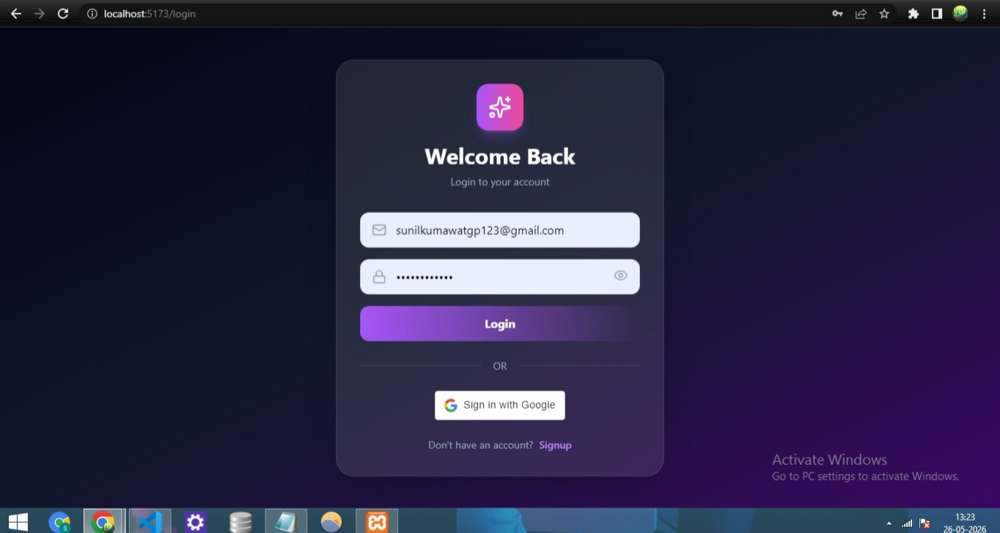
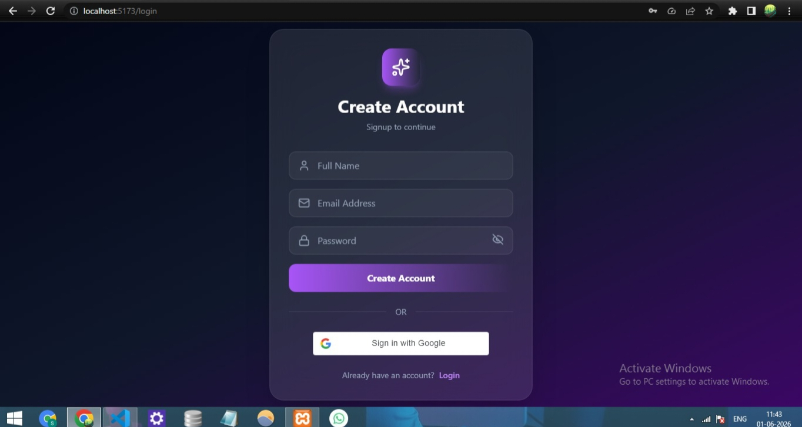
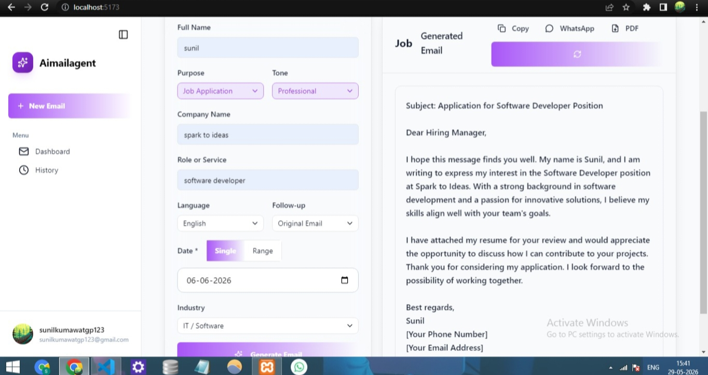
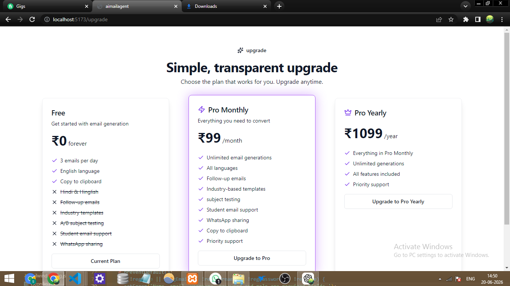
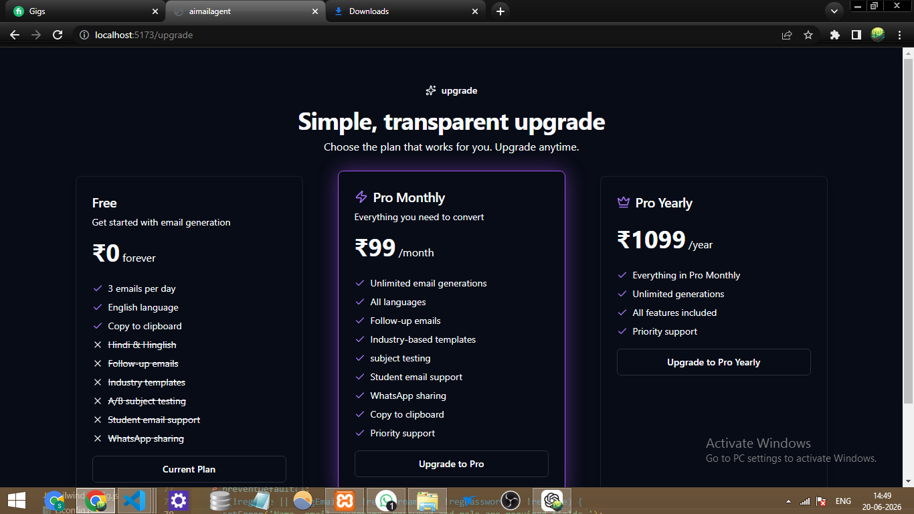
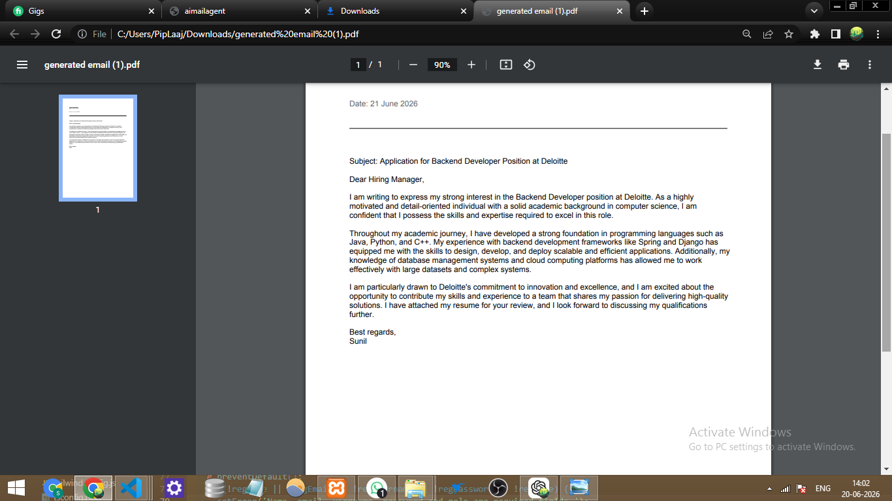

# Cold Email Generator

Cold Email Generator is a web application that helps users generate professional cold emails using AI.

Users can create an account, log in, generate emails for different purposes, and manage their usage through a simple dashboard.

## Features

* User Signup and Login
* Google Login
* AI-Powered Cold Email Generation
* Usage Tracking
* Subscription Plan Support
* Responsive Design

## Technologies Used

Frontend:

* React
* TypeScript
* Tailwind CSS

Backend:

* PHP
* MySQL

AI:

* OpenRouter API

Payment:

* Razorpay

## How to Run

1. Clone the repository.
2. Install frontend dependencies using npm install.
3. Start the frontend using npm run dev.
4. Move the backend folder to XAMPP htdocs.
5. Start Apache and MySQL.
6. Create the database and import the required tables.
7. Add API keys in the .env file.

## Author

Sunil Kumawat

LinkedIn:
https://www.linkedin.com/in/sunil-kumawat-410454340

## Note

This project was built for learning, portfolio, and practical AI integration experience.

## Screenshots

### Login Page

### Signup Page

### Dashboard (Light Theme)

### Dashboard (Dark Theme)

### Subscription Plan (Light Theme)

### Subscription Plan (Dark Theme)

### Generated Email PDF

